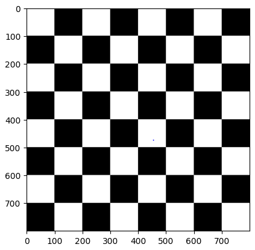
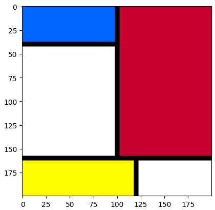
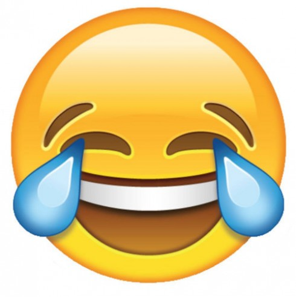
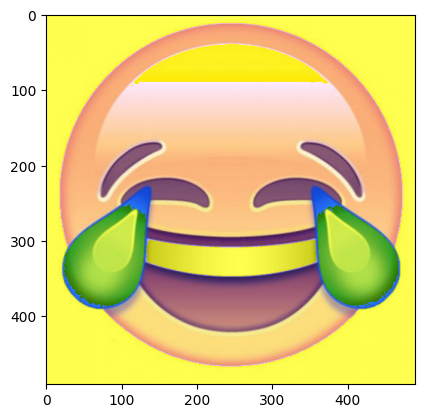
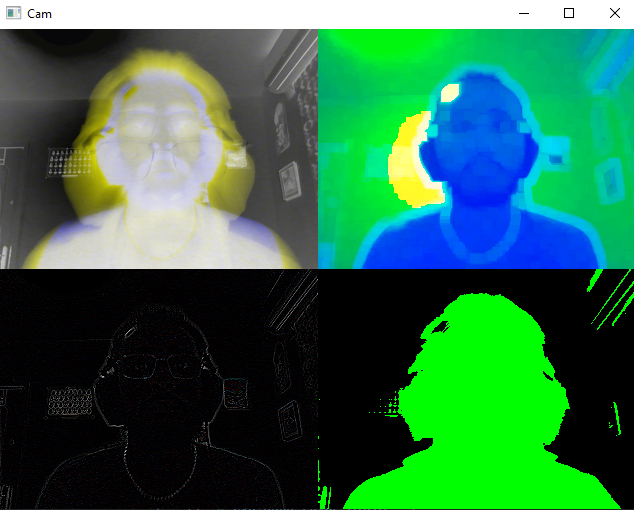

# P1 - Primeros pasos con OpenCV
  
## Desarrollo

### Tablero de ajedrez

**El código genera un tablero de ajedrez en blanco y negro con cuadrados de un tamaño determinado.**

- Se crea la matriz chess_boards con dimensiones 800x800 con 1 plano de color, se inicializacon todos los elementos a 0, lo que ocasiona un fondo negro en una imagen en escala de grises.

- Se define el tamaño de los cuadrados que compondran nuestro tablero.

- El código utiliza 2 bucles anidados para iterar a través de las filas y columnas de la matriz chess_board con un salto del tamaño de cuadrado que se define anteriormente. Estos bucles se encargan de rellenar los cuadrados del tablero de ajedrez de blanco en el caso de que el índice de la fila más el índice de la columna sea par.

- El código muestra la imagen de 2 formas distintas: a través de una ventana con la imagen del tablero esperando que el usuario presione una tecla en la ventana para cerrarla, y mostrando una figura Matplotlib del tablero.



Figura 1: Tablero de ajedrez 8x8 blanco y negro

### Imagen estilo Mondrian


**El programa crea una matriz NumPy que representa una imagen de 200x200 píxeles con tres canales de color (rojo, verde y azul). Inicialmente, todos los píxeles están configurados en negro.**

Luego se configuran partes dela imagen para que tomen un color distiinto, tomando un ejemplo:
```py
mondrian_image[0:40,0:100,2] = 255
mondrian_image[0:40,0:100,1] = 100
```
- Se realiza una modificación en la imagen en un área específica definida por los dos primeros índices. El tercer índice determina el canal de color que está siendo modificado. En este caso, estas líneas crean un cuadrado de color azul en las coordenadas especificadas. Esto se repite creando cuadrados de distintos colores a una determinada distancia para conseguir que la imagen tenga un estilo Mondrian.

- `plt.imshow(color_img)`: Utiliza Matplotlib para mostrar la imagen de color generada en una figura.

- `plt.show()`: Muestra la figura Matplotlib con la imagen de color enriquecida con formas y colores.



Figura 2: Mondrian por Willy Escovilla

")

Figura 3: Mondrian por Eduardo Etopa(un poco feo)


### Funciones de dibujo de OpenCV
**El código presenta una alternativa utilizando la librería OpenCV. Crea formas geométricas(rectángulos y líneas) para realizar una imagen muy similar a la obtenida anteriormente.**

- `cv2.rectangle(color_image, (0,0), (200,200), (255,255,255), 200)`: Utiliza OpenCV para generar un rectángulo blanco entre las coordenadas especificadas, siendo el último parámetro de la función el grosor de la figura, o en el caso de ser -1, crear una figura rellenada

- `cv2.line(color_image, (100, 0), (100, 160), (0,0,0), 3)`: Genera una línea negra desde las coordendas especificadas en el primer parámetro hasta las coordenadas del segundo.


### Modificación de valores de un plano de imagen

El código primero separa los 3 planos de color de la imagen en variables `r`(red), `g`(green), y `b`(blue)

- `r_modificado = r + 80`: Se modifica el valor de uno de los planos de color en la imagen proporcionada.
- `emoji_modified = cv2.merge((b, g, r_modificado))`: Crea una nueva imagen combinando los canales modificados

  
  
  Figura 4: Imagen sin modificaciones

  
  
  Figura 5: Imagen modificada


  

### Destacado del pixel más claro y del más oscuro

En esta tarea se realiza una captura de vídeo a través de la Webcam, a través de un bucle se captura cada frame de la cámara.

- Se pasa la imagen a escala de grises porque asi es más sencillo averiguar cual es el píxel más y menos saturado.

- `min_val, max_val, min_loc, max_loc = cv2.minMaxLoc(gray_frame)`: Se halla el valor maximo y minimo y su posicion
- `cv2.circle(frame, min_loc, 4, (200, 100, 255), 2)`: El código dibuja un círculo en el píxel menoss saturado
  
- Mostramos en una ventana emrgente caada frame de la cámara mostrando el vídeo con los círculos

### Destacado de la región 8x8 más clara y la más oscura

En esta tarea el objetivo es el mismo que en la anterior, sin embargo se tendrán en cuenta conjuntos de pixeles de tamaño 8x8.

- Se recorre la imagen pixel por pixel
- `np.mean(frame[x:x+8,y:y+8])`: Se halla el valor medio entre el pixel en la posición x,y y sus vecinos
- Se actualizan las variables que contienen el máximo, el mínimo y sus posiciones en caso de encontrar un nuevo máximo o mínimo
- Se dibuja en la región más oscura y más clara unos círculos

### Propuesta de popart


- Se convierte el cuadro a escala de grises (`gray_frame`) y se descompone en sus canales RGB (`r`, `g` y `b`).

- En la región superior izquierda (`tl`) se crea una imagen con 2 de los canales de color en escala de gris y uno en negativo y se combina con el canal verde, resultando en una imagen de tonos amarillos y azules.

- En la región superior derecha (`tr`), se detecta el color rojo en el cuadro:
        ```
        lower_red = np.array([0, 100, 100])
        upper_red = np.array([10, 255, 255])```

 y se realiza una serie de operaciones para resaltar los píxeles rojos y azules. 
 
 - `tr[:,:,:] = cv2.dilate(tr[:, :, :], kernel, iterations=2)`: Luego, se aplica una dilatación a la imagen resultante con una matriz kernel de 5x5.

- En la región inferior izquierda (`bl`), se convolusiona la imagen empleando un kernel para conseguir un filtro Laplaciano.

- En la región inferior derecha (`br`), se crea un efecto de duotono en negro y verde.


Este código crea una experiencia visual **única**



Figura 6: Pop art

## Fuentes de información

Como ayuda para obtener ideas y tipos de filtros que se pueden aplicar empleando OpenCV así como para aprender como convolusionar una imagen con un kernel se han visitado estas páginas:
- [learnopencv](https://learnopencv.com/image-filtering-using-convolution-in-opencv/#gauss-blur-opencv)
- [desktop.arcgis](https://desktop.arcgis.com/es/arcmap/latest/manage-data/raster-and-images/convolution-function.htm#:~:text=La%20funci%C3%B3n%20de%20convoluci%C3%B3n%20realiza,realces%20basados%20en%20el%20kernel)
- [docs.opencv.org](https://docs.opencv.org/4.x/d4/d86/group__imgproc__filter.html)


Realizado por:
- Eduardo Etopa Lechuga
- Willy Escovilla Biason


